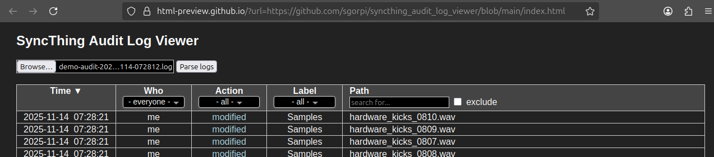
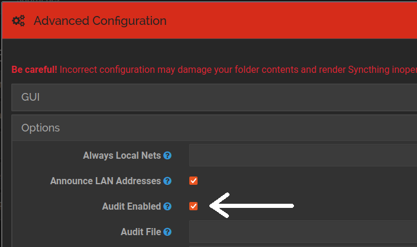

# Syncthing Audit Log File Viewer

A simple static webpage to parse and view your [SyncThing](https://syncthing.net/) audit logs within your browser.

The viewer features light and dark modes, and allows you to filter for devices, actions, labels and/or file paths.

### [>> Try it online <<](https://html-preview.github.io/?url=https://github.com/sgorpi/syncthing_audit_log_viewer/blob/main/index.html)

or download the repository and run it locally (no server needed).

## Where to find the syncthing audit logs?
Audit logs can typically be found in 
`$XDG_STATE_HOME/syncthing` or `$HOME/.local/state/syncthing` (Unix-like),
`$HOME/Library/Application Support/Syncthing` (Mac), 
or `%LOCALAPPDATA%\Syncthing` (Windows).

## How to enable audit logging?

To enable audit logs, run syncthing with `syncthing --audit` (see SyncThing's [command line options](https://docs.syncthing.net/users/syncthing.html#cmdoption-audit)),
or add `<auditEnabled>true</auditEnabled>` to the `<options>` of your [config.xml](https://docs.syncthing.net/users/config.html#config-option-options.auditenabled).
The latter can also be achieved in the web-gui, by going to the item `Advanced` in the `Actions` menu. Within that, the category `Options` has a checkbox for `Audit Enabled`.

